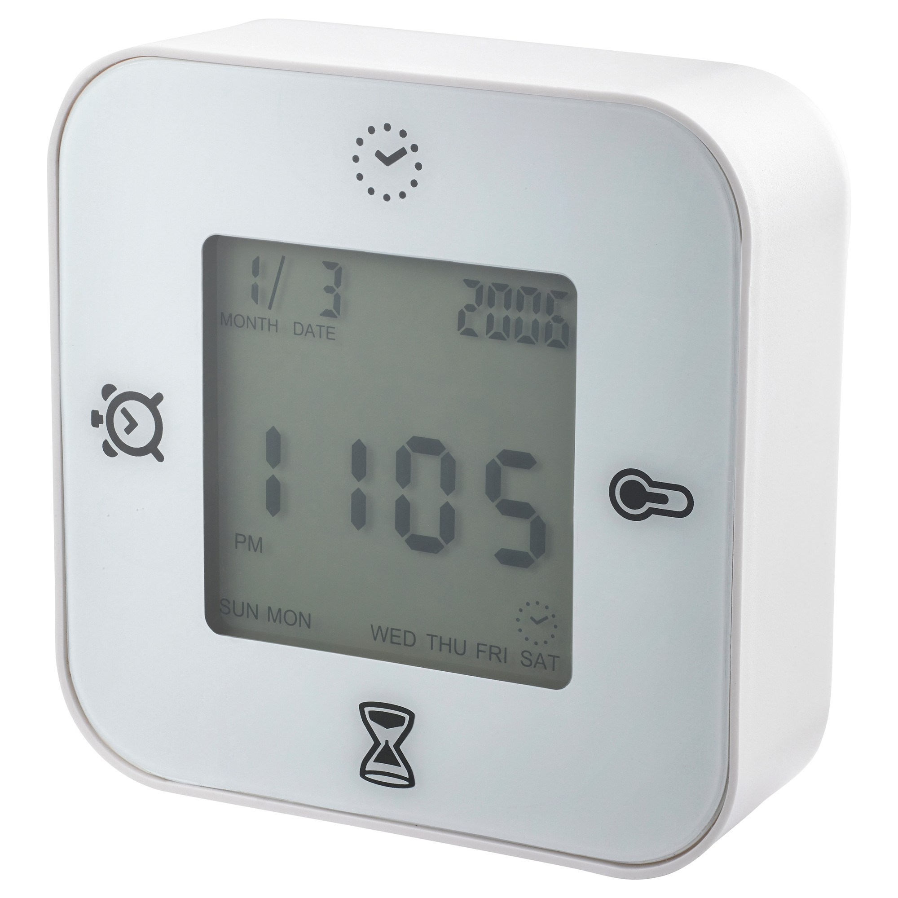
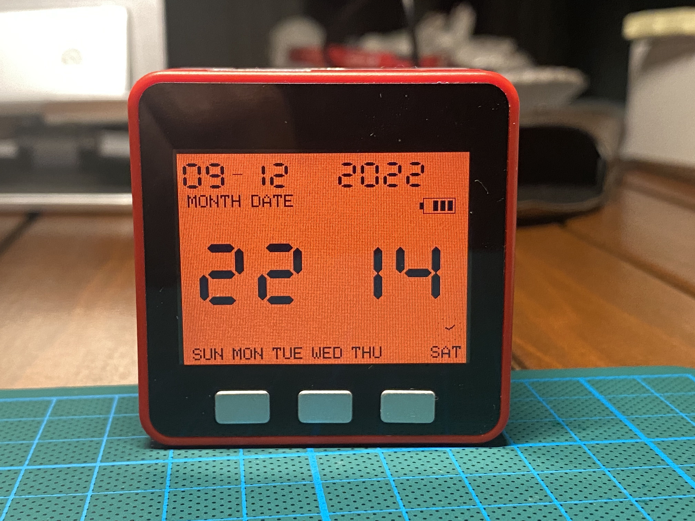
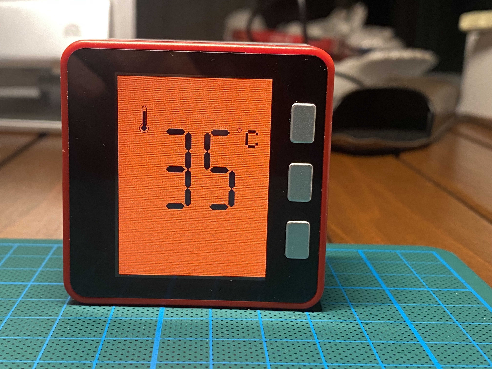
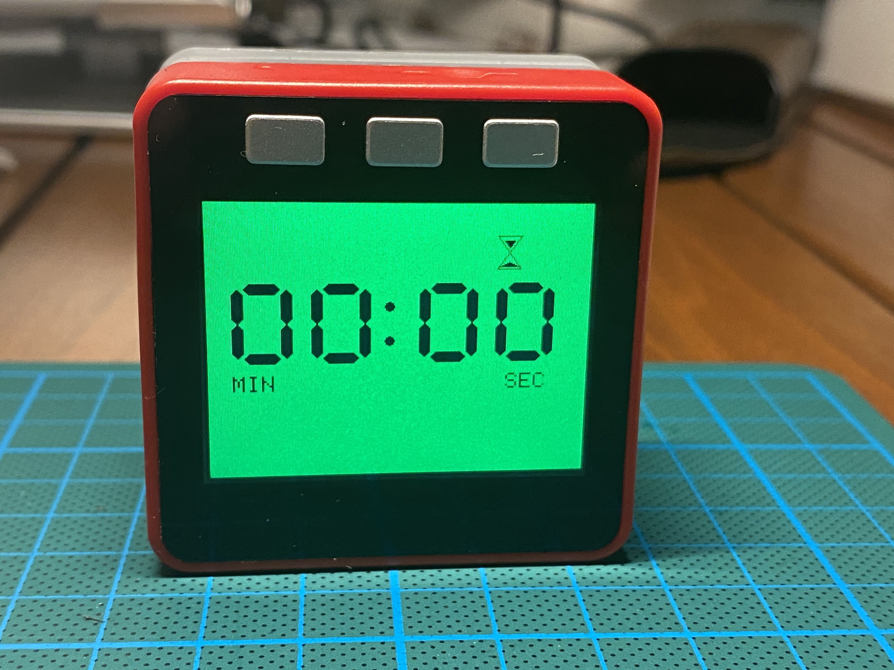
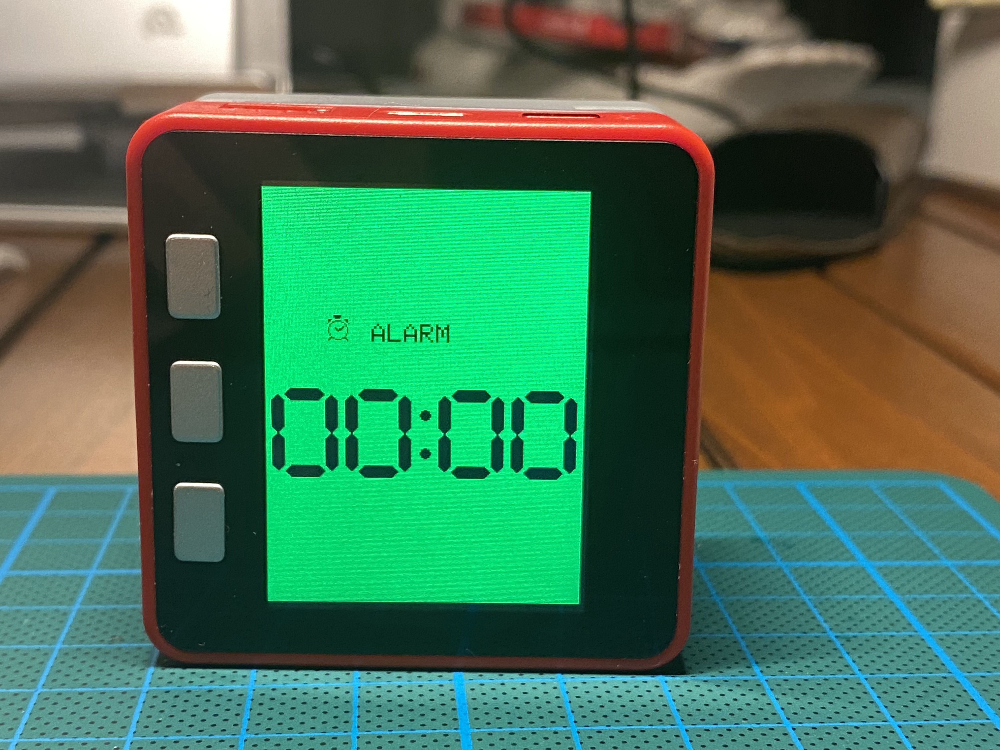

# M5Stack_IKEA_Clock

I stumbled upon [this Youtube video](https://www.youtube.com/watch?v=JJF_fdYlb9Y) in which someone from Japan managed to replicate IKEA Klockis Travel clock with a M5Stack. 

I managed to found out its source code from [the blog of the user "yankee"](https://qiita.com/yankee/items/1591724d8a2722951c7e#%E3%82%A2%E3%83%A9%E3%83%BC%E3%83%A0%E6%A9%9F%E8%83%BD). I made some changes to make it compliant with Home Assistant.

This project is a replication of IKEA Klockis Travel Clock on M5Stack:



M5stack Version shows date and time, and when you roll it over 90 degrees it shows temperature, and roll it again there comes timer and roll one more time, there it is, the alarm setting page:



### 1. Clock / Date Page: 

Gets the time date from NTPServer. This screen also shows Battery Left / Charging.

### 2. Temperature Page: 

Gets the temperature from any Home Assistant Temperature Sensor via MQTT message.

### 3. Alarm Page: 

Alarm blinks the RGB LEDs and buzzer sound included.

### 4. Timer Page: 

Alarm blinks the RGB LEDs and buzzer sound included.

## MQTT API:

### Command Topic: m5ikea/command

### Command message:

```
{
    "temperature": -8,
    "brightness": 10,
    "powersave": true,
    "timer" : "03:15",
    "alarm" : "14:12"    
}
```

You can use only one of, or more of the commands in the json like:

```
{"temperature": 34}
```

temperature (signed float): It still will show as signed integer in the clock.

brightness (unsigned integer): Between 0-100, 100 being brightest, 1 dimmest, 0 shut down LCD.

powersave (boolean): true dims the LCD to "10" after keeping the clock some sceonds in the same position, whether plugged in or battery.

timer (char, XX:XX): 00:00 to 99:99

alarm (char, XX:XX): 00:00 to 23:59

* This uses the MPU8668 accelerator version of M5Stack Fire (core). If your m%Stack has MPU9250 (Early version) or other, you need to change the accelerometer code.

* Compiled with Arduino IDE 2.0

